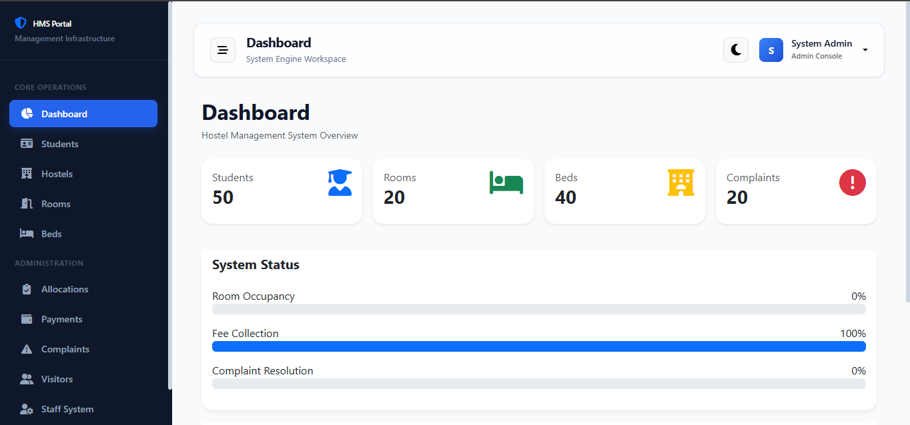
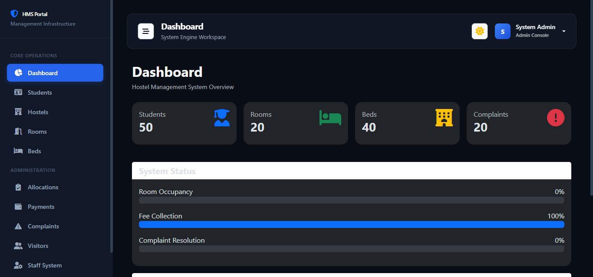
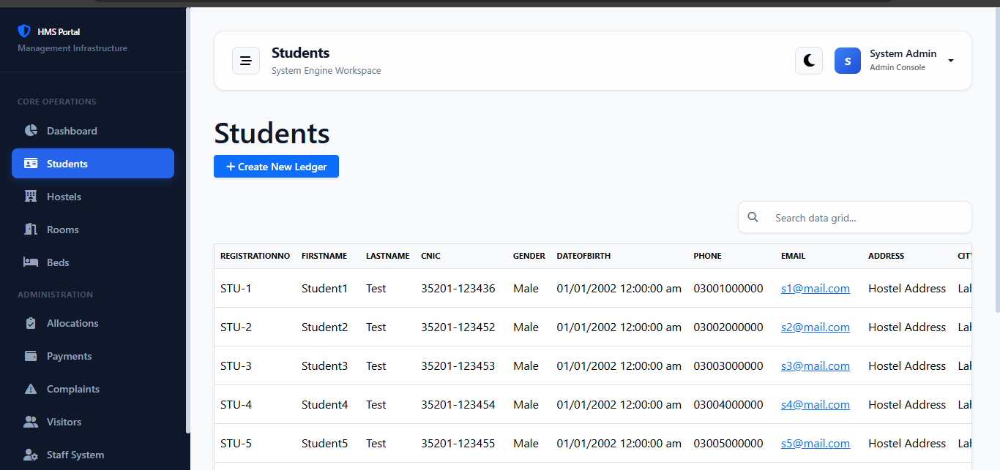
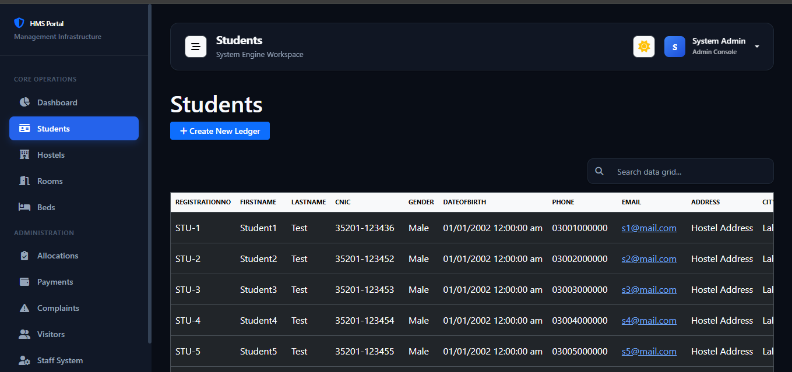

<div align="center">

# 🏨 Hostel Management System

### Modern Full-Stack Hostel Management Dashboard  
Built with ASP.NET Core MVC 🚀

<p align="center">
  
  
  
  
</p>

</div>

---

# ✨ Overview

Hostel Management System is a professional full-stack web application developed to simplify and modernize hostel administration.

The system helps manage:

- 👨‍🎓 Students
- 🛏️ Rooms & Hostel Records
- 📝 Complaints
- 🚶 Visitors
- 🔐 Authentication & Roles
- 📊 Dashboard Analytics

---

# 🚀 Features

## 🔐 Authentication & Security
- ASP.NET Identity Authentication
- Role-Based Authorization
- Secure Login System

## 👨‍🎓 Student Management
- Add/Edit/Delete Students
- Student Records Management
- Detailed Student Profiles

## 🛏️ Hostel Management
- Room Allocation
- Hostel Record Tracking
- Occupancy Management

## 📝 Complaint System
- Complaint Registration
- Complaint Tracking
- Status Management

## 🚶 Visitor Management
- Visitor Entry Records
- Visitor Tracking System

## 📊 Dashboard
- Interactive Admin Dashboard
- Modern UI Design
- Responsive Layout

---

# 🛠️ Tech Stack

| Technology | Usage |
|------------|-------|
| ASP.NET Core MVC | Backend Framework |
| Entity Framework Core | ORM |
| SQL Server | Database |
| Razor Views | Frontend Rendering |
| Bootstrap 5 | UI Styling |
| JavaScript | Client-side Functionality |

---

# 📸 Screenshots

> Replace image paths with your actual screenshot paths.

## 🖥️ Dashboard

<p align="center">
  
  
</p>

---

## 👨‍🎓 Student Management

<p align="center">
  
  
</p>

---

# ⚙️ Installation

## 1️⃣ Clone Repository

```bash
git clone https://github.com/MFW-1/HMSD.git
```

---

## 2️⃣ Open Project

Open the `.sln` file in:

- Visual Studio 2022+

---

## 3️⃣ Configure Database

Update connection string inside:

```json
appsettings.json
```

Example:

```json
"ConnectionStrings": {
  "DefaultConnection": "Server=.;Database=HostelManagementDB;Trusted_Connection=True;TrustServerCertificate=True"
}
```

---

## 4️⃣ Apply Migrations

```bash
Update-Database
```

or

```bash
dotnet ef database update
```

---

## 5️⃣ Run Application

```bash
dotnet run
```

---

# 📂 Project Structure

```bash
HostelManagementSystem/
│
├── Controllers/
├── Models/
├── Views/
├── Data/
├── wwwroot/
├── Migrations/
└── Program.cs
```

---

# 🎯 Future Improvements

- 📱 Mobile Responsive Enhancements
- 💳 Online Fee Management
- 📧 Email Notifications
- 📈 Analytics & Reports
- ☁️ Cloud Deployment

---

# 🤝 Contributing

Contributions are welcome!

1. Fork the repository
2. Create a feature branch
3. Commit changes
4. Push your branch
5. Open a Pull Request

---

# 📜 License

This project is licensed under the MIT License.

---

# 👨‍💻 Developer

## Muhammad Fahad Waseem

<p align="left">
  <a href="https://github.com/YOUR_USERNAME">
    
  </a>
</p>

---

<div align="center">

### ⭐ If you like this project, give it a star on GitHub ⭐

</div>
